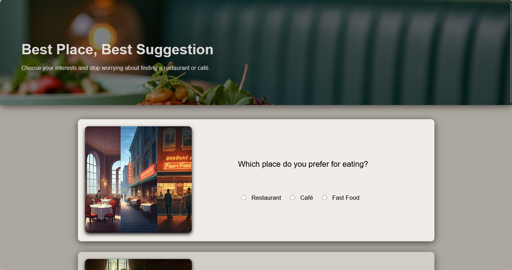
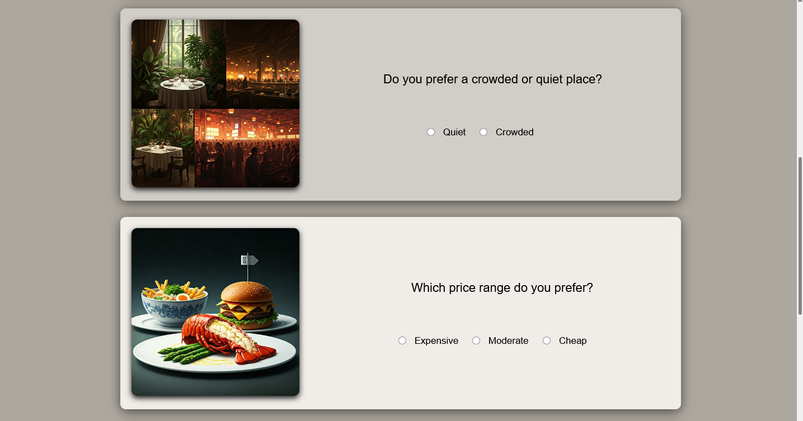
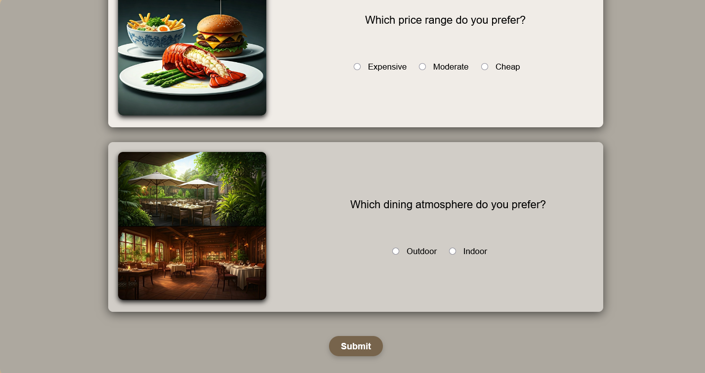
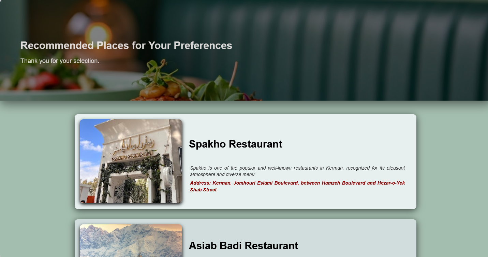
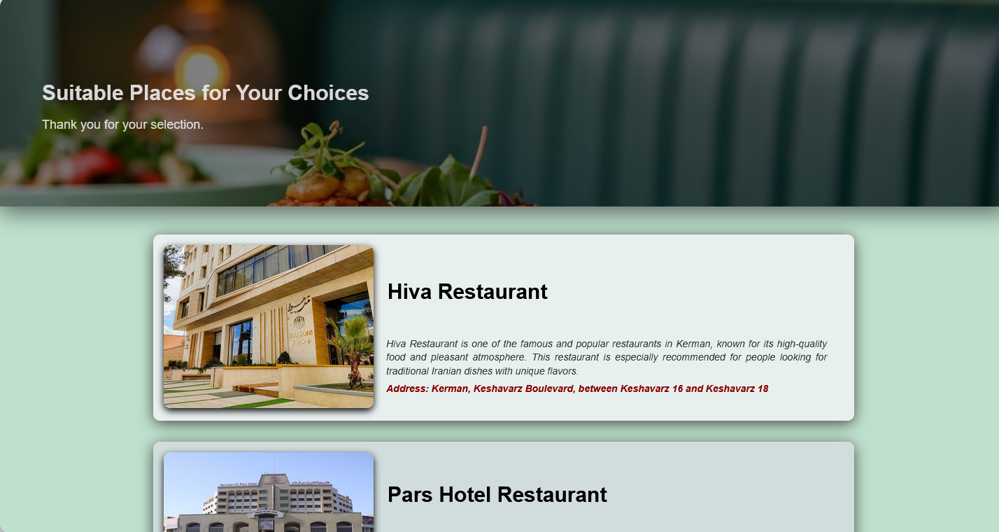
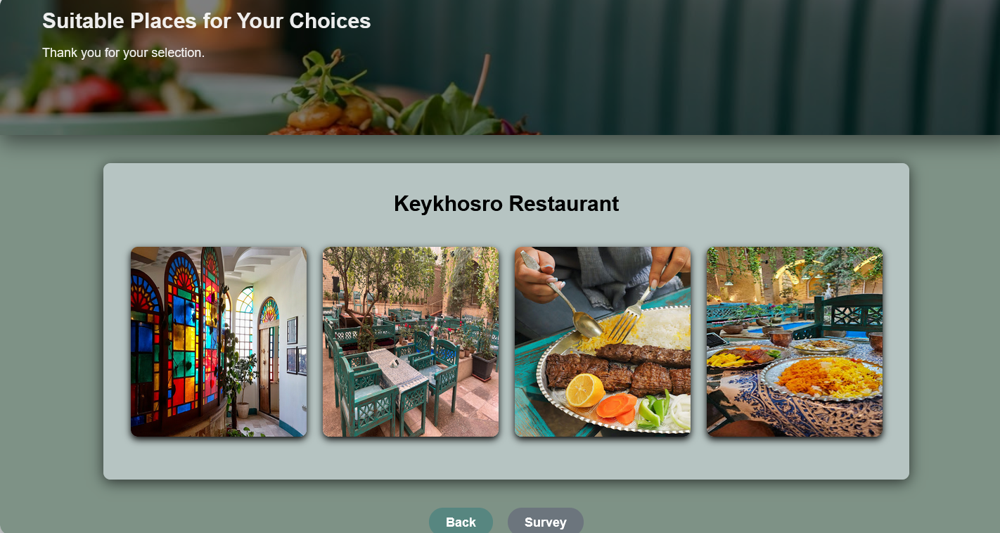
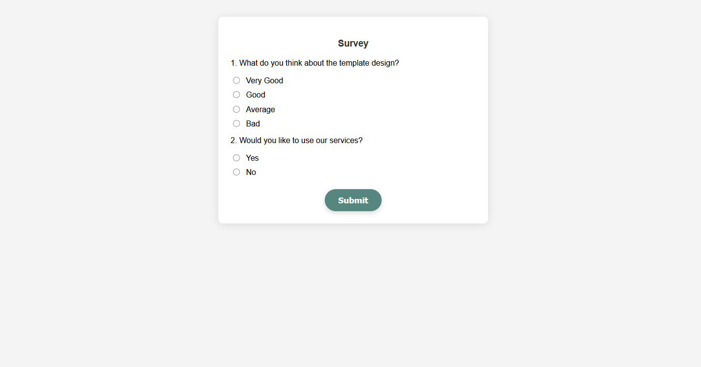
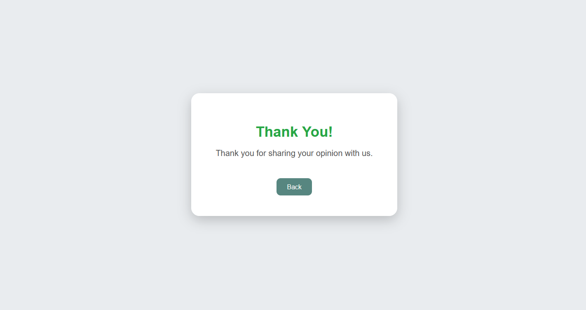

# Restaurant Recommendation Web App

This is a multi-page web project that recommends restaurants based on user preferences. The user answers a set of questions, and then receives different restaurant suggestions depending on their choices.

Each restaurant has its own dedicated page with images and details.

---

## Project Flow

The project starts from `main.html`, where the user fills out a simple questionnaire about their preferences such as:

- Type of food/place
- Environment preference (quiet or crowded)
- Budget range
- Dining atmosphere

Based on the answers, the user is redirected to recommendation pages such as:

- `newpage1.html`
- `newpage2.html`

From these pages, users can explore different restaurant options, including:

- `spakho.html`
- `wind.html`
- `pars.html`
- `keykhosro.html`
- `hiva.html`

Each restaurant page contains images and a short visual presentation of the place.

After exploring the suggestions, users can fill out a feedback survey in `test.html`.  
After submitting the survey, they are redirected to a thank-you page (`thnku.html`).

---

## Pages Overview

- `main.html` → Main questionnaire page  
- `newpage1.html` → First recommendation page  
- `newpage2.html` → Second recommendation page  
- `spakho.html` → Spakho restaurant page  
- `wind.html` → Asiab badi restaurant page  
- `pars.html` → Pars restaurant page  
- `keykhosro.html` → Keykhosro restaurant page  
- `hiva.html` → Hiva restaurant page  
- `test.html` → Survey/feedback form  
- `thnku.html` → Thank you page  

---

## Technologies Used

- HTML5  
- CSS3  
- JavaScript (Vanilla JS)

---

## Purpose of the Project

This project was built as a front-end practice project to improve:

- Multi-page website structure  
- User interaction with forms  
- Conditional navigation between pages  
- UI design and layout styling  
- Basic JavaScript functionality  

---

## Screenshots

### Main Page

### Recommendations

### Keykhosro Restaurant

### Survey Page

### Thank You Page

---

## Notes

This project is focused on front-end development only and does not include a backend or database. All navigation and logic are handled using JavaScript and static HTML pages.

