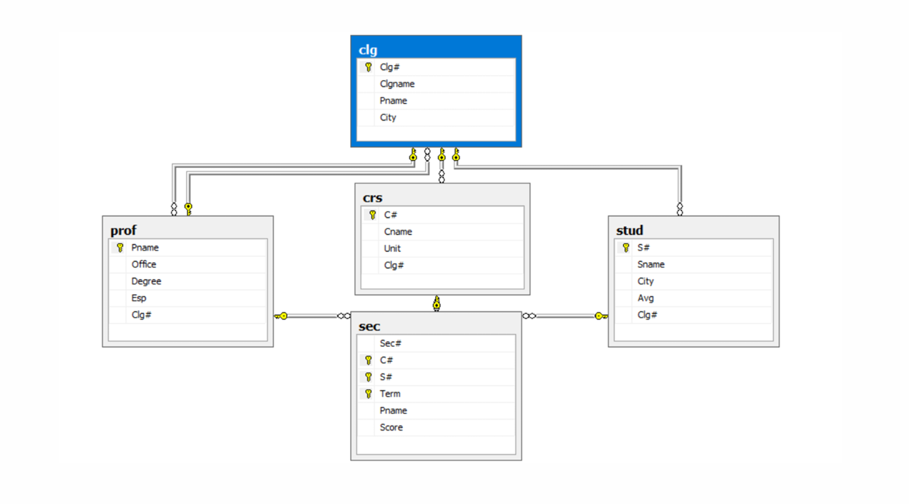
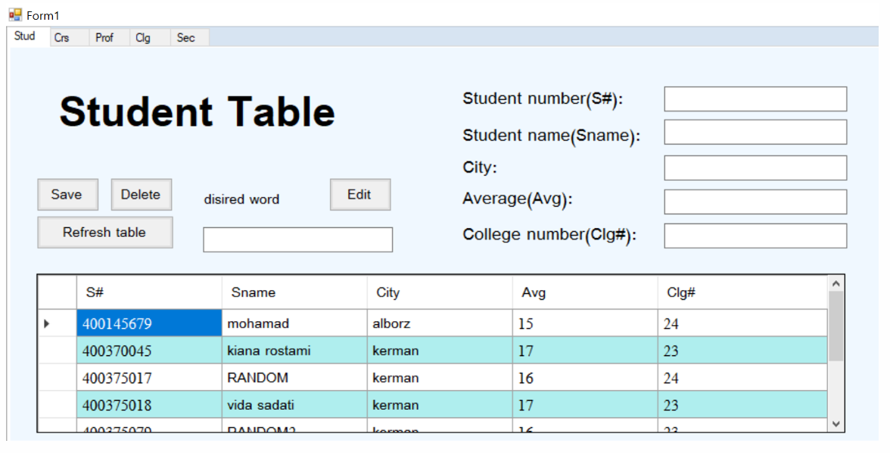
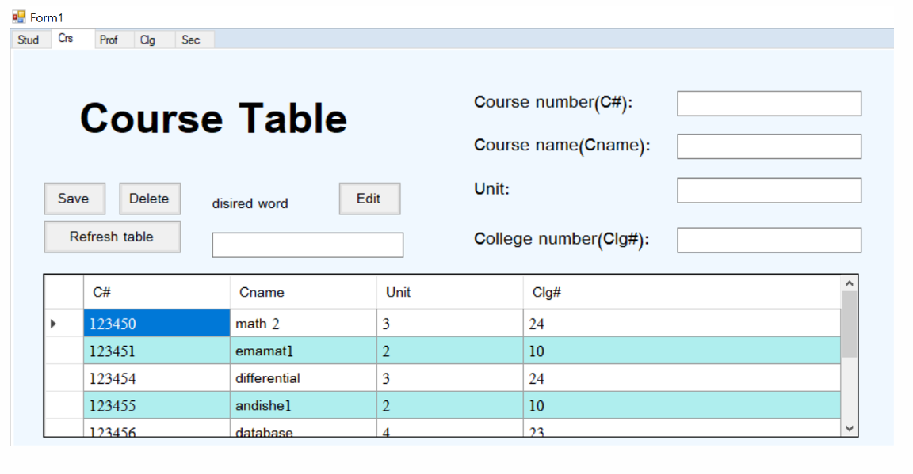

# University Database Management System

A Windows Forms application developed using C# and SQL Server for managing university data.

## Features

- Student management
- Course management
- Professor management
- College management
- Section management
- CRUD operations (Insert, Update, Delete, Refresh)
- SQL Server database integration
- DataGridView visualization

## Technologies

- C#
- Windows Forms (.NET Framework)
- Microsoft SQL Server
- Visual Studio

## Database Tables

- Stud
- Crs
- Prof
- Clg
- Sec

## Database Schema

## Screenshots

### Student Table

### Course Table

### Professor Table

## Author

Vida Sadati